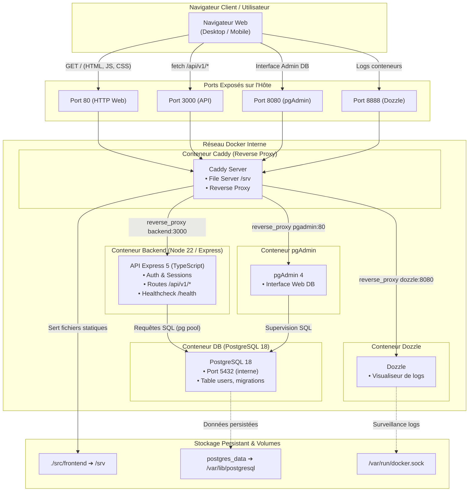

# 1. Architecture des Conteneurs Docker

```mermaid
graph TB
    subgraph Client["Navigateur Client / Utilisateur"]
        Browser["Navigateur Web<br/>(Desktop / Mobile)"]
    end

    subgraph HostPorts["Ports Exposés sur l'Hôte"]
        P80["Port 80 (HTTP Web)"]
        P3000["Port 3000 (API)"]
        P8080["Port 8080 (pgAdmin)"]
        P8888["Port 8888 (Dozzle)"]
    end

    subgraph DockerNetwork["Réseau Docker Interne"]
        subgraph CaddyContainer["Conteneur Caddy (Reverse Proxy)"]
            CaddyServer["Caddy Server<br/>• File Server /srv<br/>• Reverse Proxy"]
        end

        subgraph BackendContainer["Conteneur Backend (Node 22 / Express)"]
            ExpressAPI["API Express 5 (TypeScript)<br/>• Auth & Sessions<br/>• Routes /api/v1/*<br/>• Healthcheck /health"]
        end

        subgraph DBContainer["Conteneur DB (PostgreSQL 18)"]
            Postgres["PostgreSQL 18<br/>• Port 5432 (interne)<br/>• Table users, migrations"]
        end

        subgraph AdminContainer["Conteneur pgAdmin"]
            PgAdmin["pgAdmin 4<br/>• Interface Web DB"]
        end

        subgraph LogContainer["Conteneur Dozzle"]
            Dozzle["Dozzle<br/>• Visualiseur de logs"]
        end
    end

    subgraph Volumes["Stockage Persistant & Volumes"]
        VFrontend["./src/frontend ➔ /srv"]
        VPGData["postgres_data ➔ /var/lib/postgresql"]
        VSock["/var/run/docker.sock"]
    end

    %% Connexions Client -> Ports
    Browser -->|"GET / (HTML, JS, CSS)"| P80
    Browser -->|"fetch /api/v1/*"| P3000
    Browser -->|"Interface Admin DB"| P8080
    Browser -->|"Logs conteneurs"| P8888

    %% Ports -> Caddy
    P80 --> CaddyServer
    P3000 --> CaddyServer
    P8080 --> CaddyServer
    P8888 --> CaddyServer

    %% Caddy -> Services
    CaddyServer -->|"Sert fichiers statiques"| VFrontend
    CaddyServer -->|"reverse_proxy backend:3000"| ExpressAPI
    CaddyServer -->|"reverse_proxy pgadmin:80"| PgAdmin
    CaddyServer -->|"reverse_proxy dozzle:8080"| Dozzle

    %% Backend & pgAdmin -> DB
    ExpressAPI -->|"Requêtes SQL (pg pool)"| Postgres
    PgAdmin -->|"Supervision SQL"| Postgres
    Dozzle -.->|"Surveillance logs"| VSock
    Postgres -.->|"Données persistées"| VPGData
```